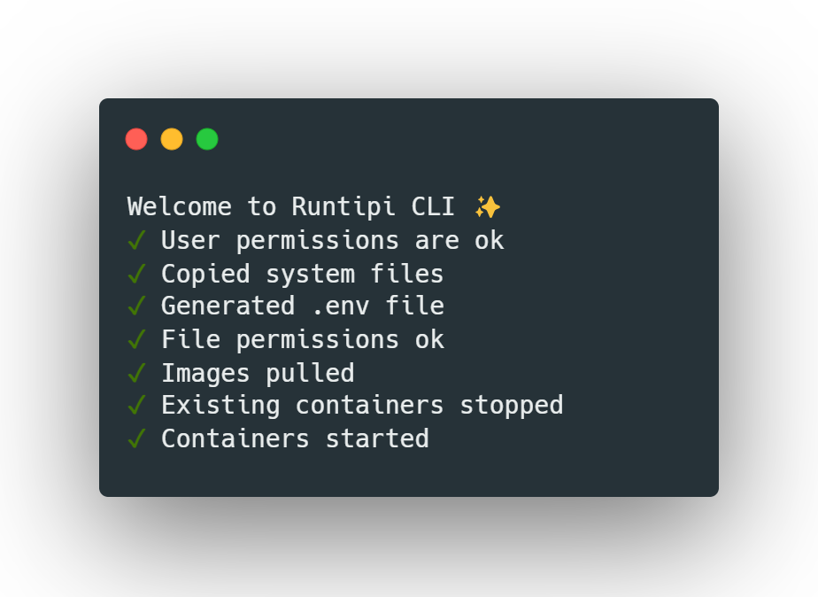

# Runtipi CLI - Manage your Runtipi instance from the command line!

<!-- ALL-CONTRIBUTORS-BADGE:START - Do not remove or modify this section -->

[](https://github.com/runtipi/cli/blob/main/LICENSE)
[](https://github.com/runtipi/cli/releases)

[](#contributors-)

<!-- ALL-CONTRIBUTORS-BADGE:END -->

> 💡 Runtipi CLI is written in Rust! If you want to collaborate on a cool project, join the discussion on Discord!



> ⚠️ Tipi is built and maintained by volunteers. There is no guarantee of support or security when you use Tipi. While the system is considered stable, it is still in active development and may contain bugs.

Runtipi CLI is an updated version of the old typescript based CLI that many of you used. The old CLI was slow, big in size and insecure. So we are happy to present you the all new Rust CLI. It is just a few killobytes, extremely fast and very secure. With the new CLI we don't need to depend on a node js runtime so the speed is faster than ever! To get started follow the instructions bellow.

## Getting Started

If you already have a runtipi instance you can just stop it delete the old cli and download our new one from the release page [here](https://github.com/runtipi/cli/releases).

> ⚠️ The CLI version and tipi version should match in order for the installation to work. If you try to use a different cli and tipi version you may encouter issues.

## 🔨 Building locally

If you like to you can build the CLI locally in your own machine. To do that you must have cargo and rust installed on your system. Then you can just clone the repository with:

```bash
git clone --depth 1 https://github.com/runtipi/cli
```

Then you can just build the CLI with:

```bash
cargo build
```

The CLI will be in the `target/debug/` folder named `runtipi-cli`

## ❤️ Contributing

Rust is a new language for the runtipi team. If you have any rust knowledge we are happy to accept contributions and your name will be added in the "Contributors" section below.

## 📜 License

[](https://github.com/runtipi/cli/blob/master/LICENSE)

Runtipi CLI is licensed under the GNU General Public License v3.0. TL;DR — You may copy, distribute and modify the software as long as you track changes/dates in source files. Any modifications to or software including (via compiler) GPL-licensed code must also be made available under the GPL along with build & install instructions.

## 🗣 Community

- [Twitter](https://twitter.com/runtipi)
- [Discord](https://discord.gg/Bu9qEPnHsc)

## 🙏 Acknowledgements

- [Carbon](https://carbon.now.sh/) - Thanks for providing the Runtipi CLI screenshot.

## ✨ Contributors

Thanks goes to these wonderful people ([emoji key](https://allcontributors.org/docs/en/emoji-key)):

<!-- ALL-CONTRIBUTORS-LIST:START - Do not remove or modify this section -->
<!-- prettier-ignore-start -->
<!-- markdownlint-disable -->

<!-- markdownlint-restore -->
<!-- prettier-ignore-end -->

<!-- ALL-CONTRIBUTORS-LIST:END -->

Did you contribute and want to see your name listed in the README? Write a comment [here](https://github.com/runtipi/cli/issues/11)
This project follows the [all-contributors](https://github.com/all-contributors/all-contributors) specification. Contributions of any kind welcome!
