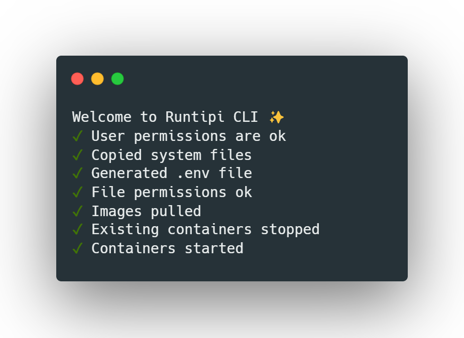

# Runtipi CLI - Manage your Runtipi instance from the command line!

[](https://github.com/runtipi/cli/blob/main/LICENSE)
[](https://github.com/runtipi/cli/releases)


<!-- ALL-CONTRIBUTORS-BADGE:START - Do not remove or modify this section -->
[
<!-- ALL-CONTRIBUTORS-BADGE:END -->

> 💡 Runtipi CLI is written in Go! If you want to collaborate on a cool project, join the discussion on Discord!



> ⚠️ Runtipi CLI is built and maintained by volunteers. There is no guarantee of support or security when you use Runtipi CLI. While the system is considered stable, it is still in active development and may contain bugs.

Runtipi CLI is an updated version of the previous CLI implementations. Written in Go, this version offers improved performance, reliability, and a smaller footprint. It provides a streamlined experience for managing your Runtipi instance directly from the command line. To get started, follow the instructions below.

## Getting Started

If you already have a runtipi instance you can just stop it delete the old cli and download our new one from the release page [here](https://github.com/runtipi/cli/releases).

> ⚠️ The CLI version and tipi version should match in order for the installation to work. If you try to use a different cli and tipi version you may encouter issues.

## 🔨 Building locally

If you'd like to build the CLI locally on your own machine, you'll need to have Go installed on your system. Then you can clone the repository with:

```bash
git clone --depth 1 https://github.com/runtipi/cli
```

Then you can build the CLI with:

```bash
make build
```

Or you can run it directly with:

```bash
make run ARGS="command arguments"
```

The built CLI binary will be in the root folder named `runtipi-cli`.

## ❤️ Contributing

We welcome contributions to the Runtipi CLI! If you have Go programming experience or ideas to improve the CLI, feel free to submit pull requests or open issues. Your name will be added to the "Contributors" section below when your contributions are merged.

## 📜 License

[](https://github.com/runtipi/cli/blob/master/LICENSE)

Runtipi CLI is licensed under the GNU General Public License v3.0. TL;DR — You may copy, distribute and modify the software as long as you track changes/dates in source files. Any modifications to or software including (via compiler) GPL-licensed code must also be made available under the GPL along with build & install instructions.

## 🗣 Community

- [Twitter](https://twitter.com/runtipi)
- [Discord](https://discord.gg/Bu9qEPnHsc)

## 🙏 Acknowledgements

- [Carbon](https://carbon.now.sh/) - Thanks for providing the Runtipi CLI screenshot.

## ✨ Contributors

Thanks goes to these wonderful people ([emoji key](https://allcontributors.org/docs/en/emoji-key)):

<!-- ALL-CONTRIBUTORS-LIST:START - Do not remove or modify this section -->
<!-- prettier-ignore-start -->
<!-- markdownlint-disable -->
<table>
  <tbody>
    <tr>
      <td align="center" valign="top" width="14.28%"><a href="https://meienberger.dev/"><br /><sub><b>Nicolas Meienberger</b></sub></a><br /><a href="#code-meienberger" title="Code">💻</a> <a href="#test-meienberger" title="Tests">⚠️</a> <a href="#infra-meienberger" title="Infrastructure (Hosting, Build-Tools, etc)">🚇</a></td>
      <td align="center" valign="top" width="14.28%"><a href="https://github.com/steveiliop56"><br /><sub><b>Stavros</b></sub></a><br /><a href="#code-steveiliop56" title="Code">💻</a> <a href="#doc-steveiliop56" title="Documentation">📖</a></td>
      <td align="center" valign="top" width="14.28%"><a href="https://github.com/hex-developer"><br /><sub><b>hex-developer</b></sub></a><br /><a href="#code-hex-developer" title="Code">💻</a></td>
      <td align="center" valign="top" width="14.28%"><a href="https://github.com/jnth"><br /><sub><b>Jonathan Virga</b></sub></a><br /><a href="#code-jnth" title="Code">💻</a></td>
    </tr>
  </tbody>
</table>

<!-- markdownlint-restore -->
<!-- prettier-ignore-end -->

<!-- ALL-CONTRIBUTORS-LIST:END -->

Did you contribute and want to see your name listed in the README? Write a comment [here](https://github.com/runtipi/cli/issues/11)
This project follows the [all-contributors](https://github.com/all-contributors/all-contributors) specification. Contributions of any kind welcome!
